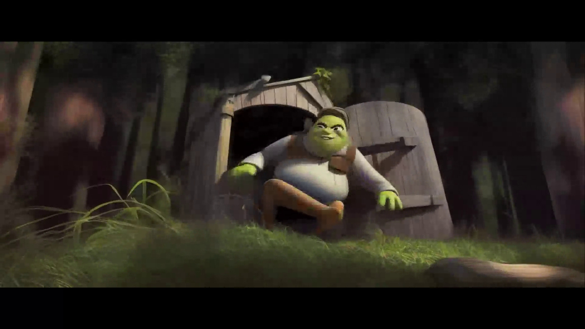

# Movie Stable Diffusionizer

## What is this?

This Python script grabs input images, interrogates CLIP with them (via WebUI), saves the prompts, and then calls img2img
with those prompts and a time-domain changing denoising strength.

The output images can then be reassembled into a movie, with strange results.

## Why?

TBD